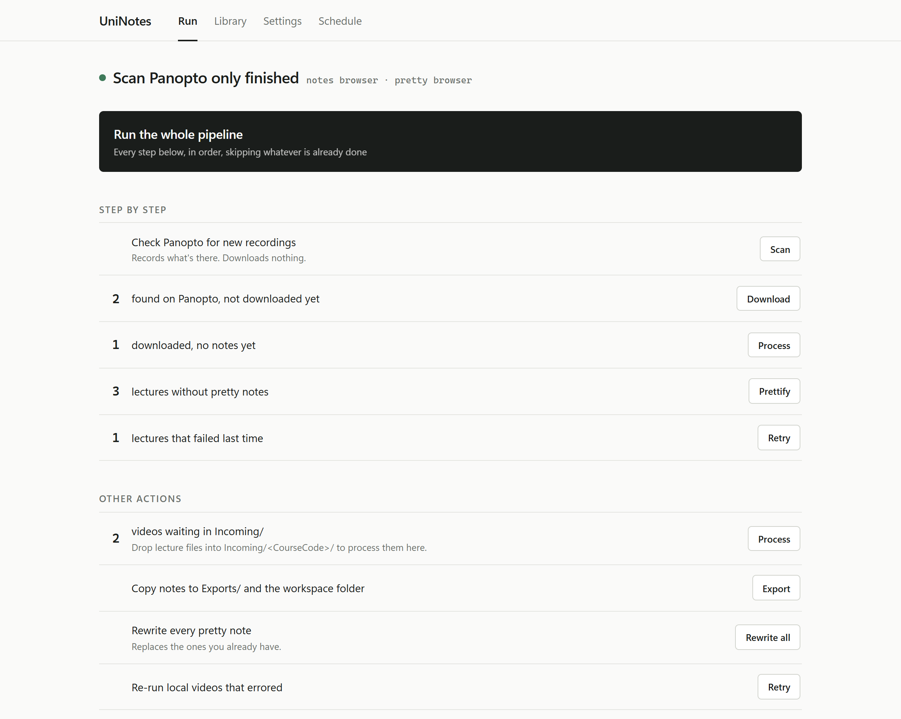
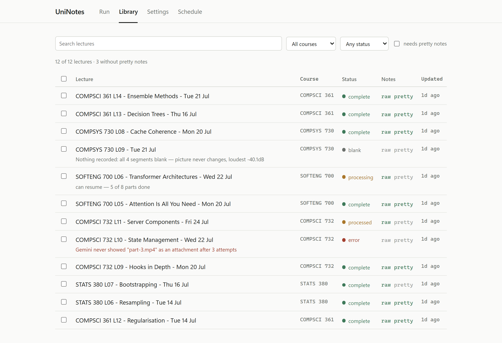
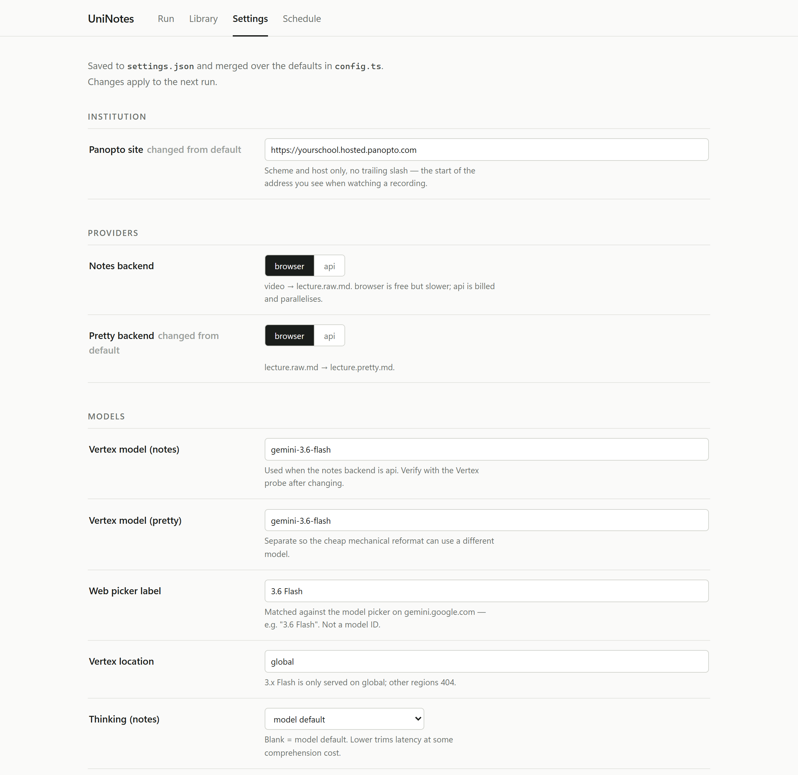

<h1 align="center">UniNotes</h1>

<p align="center">
  <strong>Turns lecture recordings into study notes, unattended.</strong><br>
  Watches your university's Panopto for new recordings, downloads them, and has
  Gemini write structured notes with timestamps.
</p>

<p align="center">
  
  
  
</p>

<p align="center">
  <picture>
    <source media="(prefers-color-scheme: dark)" srcset="docs/images/run-dark.png">
    
  </picture>
</p>

Built for the University of Auckland, but Panopto is the same product
everywhere: set one URL and it works at any institution that uses it. Lectures
that aren't on Panopto work too, if you drop the video in a folder.

```
Panopto  →  Download  →  Gemini (notes)    →  lecture.raw.md
                      →  Gemini (prettify) →  lecture.pretty.md
                                           →  TODO.md (action items)
```

Notes land in `Lectures/<CourseCode>/<LectureTitle>/`:

```
Lectures/
  COMPSCI 732/
    [109-B28] COMPSCI 732 L01 - Fri 06 Mar/
      lecture.raw.md      # Gemini's notes
      lecture.pretty.md   # reformatted
      lecture.mp4         # original video (local lectures only)
```

Every command is also a button in the local control panel (`npm run gui`).

### Why Gemini

Gemini takes the video itself. It watches the recording, so the lecturer's words
and what's on the screen arrive together. Gone are the days of copying a
transcript and a slide deck into a chat window and hoping the model works out
which sentence went with which diagram.

Which means you can sit in the lecture and follow it instead of writing it all
down. *(Please still attend your lectures.)*

### What you'll need

Node 20 or newer, [ffmpeg](https://ffmpeg.org/download.html), and one of:

- **Gemini Pro**, for the `browser` backend. Free accounts cap video uploads at
  about five minutes, which is shorter than every segment this produces.
- **A Google Cloud account**, for the `api` backend. New accounts get
  [US$300 in trial credit](https://cloud.google.com/free).

### Contents

[Quick start](#quick-start) ·
[Two backends](#two-backends) ·
[Control panel](#control-panel) ·
[Usage](#usage) ·
[Configuration](#configuration) ·
[Reliability](#reliability) ·
[Troubleshooting](#troubleshooting) ·
[Project structure](#project-structure) ·
[Your data stays yours](#your-data-stays-yours)

---

## What comes out

`lecture.raw.md` is Gemini's notes, with YAML frontmatter and timestamps rebased
onto the full lecture. `lecture.pretty.md` is the same content restructured, with
Key Takeaways and Glossary sections added.

An abridged `lecture.pretty.md`:

```markdown
---
title: "COMPSCI 361 L14 - Ensemble Methods - Tue 21 Jul"
course: "COMPSCI 361"
date: 2026-07-21
panopto_url: "https://yourschool.hosted.panopto.com/Panopto/Pages/Viewer.aspx?id=..."
topics:
  - "Bagging"
  - "Random forests"
  - "Boosting"
---

# Ensemble Methods

## Why ensembles work

- [03:12] A single deep tree has low bias and high variance. It fits the training
  set almost exactly and moves a lot when the data moves.
- [05:40] Averaging many such models leaves the bias where it was and divides the
  variance, provided the models' errors aren't identical.

| Method | What it varies | Trained |
|---|---|---|
| Bagging | The training sample | In parallel |
| Random forest | Sample and the features at each split | In parallel |
| Boosting | The weight on each example | Sequentially |

> "Decorrelation is the whole trick. A forest of identical trees is one tree."

## Key Takeaways

- Ensembles reduce variance, not bias.
- Random forests decorrelate trees by restricting the features per split.
```

Timestamps are offsets into the full recording, and the frontmatter carries the
Panopto URL, so you can check anything ambiguous against the source.

---

## Quick start

### 1. Install

```bash
git clone https://github.com/Tahallaman/UniNotes.git
cd UniNotes
npm install
npm run setup        # downloads the Playwright browser driver for Edge
```

ffmpeg must be on your `PATH`. It splits lectures longer than 15 minutes.

<details>
<summary>Installing ffmpeg</summary>

```bash
winget install Gyan.FFmpeg      # Windows
brew install ffmpeg             # macOS
sudo apt install ffmpeg         # Debian/Ubuntu
```

Open a new terminal afterwards, then check with `ffmpeg -version`.
</details>

### 2. Set your Panopto host

The first part of the address you see while watching a recording:

```
https://yourschool.hosted.panopto.com/Panopto/Pages/Viewer.aspx?id=...
^--------------- this much ---------------^
```

The regional suffix varies by institution: `.hosted.`, `.eu.`, `.au.`, `.ca.`
Set it any of three ways:

```bash
npm run gui                                       # Settings → Institution → Panopto site
```
```ts
// config.ts
panopto: { baseUrl: "https://yourschool.hosted.panopto.com", ... }
```
```bash
export UNINOTES_PANOPTO_URL=https://yourschool.hosted.panopto.com
```

### 3. Sign in

Panopto and Gemini each get a persistent Edge profile, so you log in by hand once:

```bash
npm run setup-auth:panopto   # Edge opens → complete your university SSO → close it
npm run setup-auth:gemini    # Edge opens → log in to Google → close it
```

Sessions are saved to `browser-data/`.

### 4. Subscribe to your courses in Panopto

Easy to skip, and nothing works without it. The scraper reads your Panopto
**Subscriptions** page and nothing else. Being enrolled in a paper does not put
its recordings there.

Open each course folder in Panopto and use its **Subscribe** control, then load
the Subscriptions page and check every course you want notes for is on it.

### 5. Run it

```bash
npm run probe:browser   # is the profile signed in? do parallel tabs work?
npm run scan            # find new lectures, download nothing
npm run dev             # full pipeline: scan → download → notes → prettify
npm run gui             # or press buttons, at http://localhost:4571
```

---

## Two backends

Each stage runs through either backend, chosen independently:

| Backend | What it is | Trade-off |
|---|---|---|
| `browser` | Playwright driving gemini.google.com with your session | Needs Gemini Pro; slower; rate-limited by Google |
| `api` | Gemini on Vertex AI via gcloud ADC | Billed; roughly 10× faster; parallelises cleanly |

`browser` is the default. Set them per stage in `config.ts` under `providers`, in
the control panel, or per run with `--uploader=` (notes) and `--pretty=` (pretty).

<details>
<summary>Setting up the <code>api</code> backend</summary>

You need a Google Cloud project with billing enabled and the Vertex AI and Cloud
Storage APIs turned on.

```bash
gcloud auth application-default login
```

Set the project ID (control panel → Settings → Google Cloud, `vertex.project` in
`config.ts`, or `GOOGLE_CLOUD_PROJECT`), then verify:

```bash
npm run probe:vertex
```

Video chunks are staged in a Cloud Storage bucket so Vertex can read them. Leave
`vertex.gcsBucket` blank to derive `uninotes-<project>` and create it on first
use. Chunks are deleted after each part is processed.

**This costs money.** A two-hour lecture is eight video segments through a Flash
model. Check current Vertex pricing before running a semester's backlog.
</details>

---

## Control panel

```bash
npm run gui                 # opens http://localhost:4571
npm run gui -- --port=8080  # different port
npm run gui -- --no-open    # don't launch a browser
```

Binds to `127.0.0.1` only. Every button spawns the CLI command you would
otherwise have typed and streams its output live.

| Tab | What's there |
|---|---|
| **Run** | Every pipeline action, each labelled with the live count that decides whether it'll do anything ("3 videos in Incoming/", "5 lectures pending"). Health checks for ffmpeg, your Panopto site, both browser sessions and gcloud credentials. Setup, probes, maintenance. Live console with cancel. |
| **Library** | Every lecture, filterable by course, status and text, plus "missing pretty only". Select any number and process, prettify, reset, ignore or forget them. Click one for details, resume state, links and a rendered preview of its notes. |
| **Settings** | Institution, providers, models, prompts, concurrency, timeouts, browser mode, Google Cloud. |
| **Schedule** | Windows Task Scheduler entries, with presets for once/twice daily and hourly. |

<picture>
  <source media="(prefers-color-scheme: dark)" srcset="docs/images/library-dark.png">
  
</picture>

The library merges the database with the disk, so lecture folders with no
tracking row still appear and can still be prettified and opened. Each row's
status carries its reason: what the blank detector measured, what an error was,
how far a part-processed lecture got.

<picture>
  <source media="(prefers-color-scheme: dark)" srcset="docs/images/settings-dark.png">
  
</picture>

Settings save to `settings.json` and merge over the defaults in `config.ts`.
Anything you've overridden is marked *changed from default*. Changes apply on the
next run.

Design notes and wireframes: [docs/gui-design.md](docs/gui-design.md).

### Two extra commands the GUI relies on

```bash
npm run scan     # find new Panopto lectures and record them, no downloads
```

`process-selected.ts` processes a chosen set of lectures, taking its selection
from a JSON file rather than the command line, since lecture titles contain
spaces and commas:

```bash
npx tsx scripts/process-selected.ts --selection=sel.json
npx tsx scripts/process-selected.ts --selection=sel.json --pretty-only
# sel.json:  { "ids": ["<db id>", ...], "dirs": ["<lecture folder>", ...] }
```

---

## Usage

### Run the full pipeline

```bash
npm run dev
npm run dev -- --retry      # also retry lectures that previously errored
```

Scrapes Panopto, downloads what's new, processes it through Gemini, and
prettifies. Skips anything already processed.

### Process local videos

Works for any video file, not just lectures. Drop them into
`Incoming/<CourseCode>/`:

```
Incoming/
  SOFTENG 700/
    Lecture 3 - Transformers.mp4
```

```bash
npm run local
npm run local -- --retry  # retry previously errored lectures
```

The video moves to `Lectures/<CourseCode>/<Title>/lecture.mp4` afterwards.

Reprocessing a lecture replaces its notes in place. The previous raw notes are
kept as `lecture.raw.md.bak`, and the stale pretty file is removed so the next
run regenerates it.

### Prettify existing raw notes

Finds every `lecture.raw.md` with no sibling `lecture.pretty.md`:

```bash
npm run pretty
npm run pretty -- --pretty=browser   # use the web UI instead of Vertex
npm run pretty -- --force            # regenerate even where pretty notes exist
```

Every full run ends with this same sweep, so a pretty step that failed last night
is retried tonight without any flags.

### Skip lectures you don't want

Copy `ignored-lectures.example.txt` to `ignored-lectures.txt` and paste titles
into it, one per line. Library → select → Ignore in the control panel writes the
same file.

### Export notes

```bash
npm run export              # both Raw and Pretty
npm run export -- --raw     # raw only
npm run export -- --pretty  # pretty only
```

```
Exports/
  Raw/<CourseCode>/Lecture 01 - <CourseCode> - <title>.md
  Pretty/<CourseCode>/Lecture 01 - <CourseCode> - <title>.md
```

Exported notes lead with the lecture number so a folder of them sorts into
lecture order — in Obsidian, in Explorer, anywhere the list is alphabetical.
Panopto titles put the number wherever the department felt like it, or leave it
out entirely, so the number is read out of the title where it states one and
taken from the order the lectures were delivered where it doesn't:

```
ENGGEN 403 [21 July] Lecture 1 What can ENGGEN 403 do for me
  → Lecture 01 - ENGGEN 403 - [21 July] What can ENGGEN 403 do for me.md

[423-348] SOFTENG 761 L01CSOFTENG 761 L02C - Mon 20 Jul 0200 PM (NZT)
  → Lecture 01 - SOFTENG 761 - Mon 20 Jul 0200 PM (NZT).md

SOFTENG 753 - Tue 21 Jul - Introduction & What is Deep Learning   (no number)
  → Lecture 01 - SOFTENG 753 - Tue 21 Jul - Introduction & What is Deep Learning.md
```

The same name is used for the second copy (see **Configuration → Second copy**),
and notes already exported under the old name are renamed in place rather than
duplicated. `Lectures/` keeps the recording's own title either way — that title
is how a lecture is recognised as already processed. Turn the whole thing off
with `exportNaming.enabled`.

### Scheduling

The control panel's **Schedule** tab drives Windows Task Scheduler, with presets
for once daily, twice daily and hourly. On macOS or Linux, use cron:

```cron
0 3 * * *  cd /path/to/UniNotes && npm run dev >> logs/cron.log 2>&1
```

---

## Configuration

Defaults live in `config.ts`. Overrides go in `settings.json` (written by the
control panel) or in environment variables, which win over both.

| Setting | Default | Description |
|---|---|---|
| `panopto.baseUrl` | *(unset)* | **Required.** Your institution's Panopto host |
| `providers.notes` | `browser` | Backend for video → raw notes |
| `providers.pretty` | `api` | Backend for raw → pretty notes |
| `concurrency.lectures` | 3 | Lectures processed simultaneously |
| `concurrency.parts` | 4 | Parts of one lecture processed simultaneously |
| `concurrency.vertexInFlight` | 8 | Global cap on concurrent Vertex calls |
| `concurrency.gcsUploads` | 3 | Global cap on concurrent GCS uploads |
| `concurrency.browserTabs` | 3 | Global cap on concurrent Gemini tabs |
| `gemini.responseTimeout` | 10 min | Max wait for one Gemini answer |
| `gemini.uploadTimeout` | 30 min | Max wait for video upload |
| `segmentSeconds` | 900 (15 min) | Videos longer than this are split |
| `blankDetection.enabled` | true | Skip empty segments instead of sending them |
| `retry.maxRetries` | 3 | Retry attempts for download and Gemini failures |
| `browser.headless` | false | Run headless (check `npm run probe:browser` first) |
| `browser.windowMode` | `offscreen` | `normal`, `offscreen`, or `hidden` |
| `browser.tabStaggerMs` | 2000 | Gap between starting one Gemini tab and the next |
| `courseCodePatterns` | 3 regexes | How a course code is recognised |
| `vertex.project` | *(unset)* | GCP project, only needed by the `api` backend |
| `vertex.gcsBucket` | *(derived)* | Blank derives `uninotes-<project>` |
| `vertex.model` | `gemini-3.6-flash` | Model for video → notes |
| `vertex.generation.pretty.model` | `gemini-3.6-flash` | Model for prettifying |
| `vertex.location` | `global` | 3.x Flash models are only served on `global` |
| `vertex.cleanupUploads` | true | Delete GCS chunks after each part |
| `exportNaming.enabled` | true | Put the lecture number first in exported names |
| `exportNaming.numberDigits` | 2 | Width it's padded to, so 10 sorts after 9 |
| `workspace.enabled` | false | Keep a second copy of each pretty note elsewhere |
| `workspace.root` | `~/Documents/UniNotes` | Where that copy goes |
| `prompts.grounding` | `prompts/notes-grounding.txt` | Opens every notes prompt |
| `prompts.coverage` | `prompts/notes-coverage.txt` | What the notes should contain |
| `prompts.prettyRules` | `prompts/pretty-notes.txt` | The prettifier's rules |

Setting every `concurrency` value to 1 reproduces fully sequential behaviour,
which is the first thing to try when debugging.

### Prompts

Edit them under **Settings → Prompts**, or edit the files in `prompts/`. The
files are the defaults; the panel overrides them.

| Prompt | Does what |
|---|---|
| Grounding rules | Prepended to every notes prompt. The anti-invention instruction: it makes the model describe *this* recording rather than recite what it knows about a course with that name. |
| What to cover | The contents and style of the notes. Shared by the single-video, middle-part and final-part prompts. |
| Prettifier rules | Applied to finished raw notes. Safe to rewrite wholesale. |

Two pieces of every notes prompt are deliberately not settings and stay in
`src/gemini/prompts.ts`: the timestamp contract, which `src/utils/timestamps.ts`
rebases, and the `---JSON-ACTIONS---` block, which `src/notes/parser.ts` reads.
Breaking either wouldn't raise an error. It would quietly give you wrong
timestamps or no action items.

### Environment variables

These override both `config.ts` and `settings.json`. See
[`.env.example`](.env.example).

| Variable | Description |
|---|---|
| `UNINOTES_PANOPTO_URL` | Your Panopto host |
| `UNINOTES_UPLOADER` | `api` or `browser` for the notes stage |
| `UNINOTES_PRETTY` | `api` or `browser` for the pretty stage |
| `GOOGLE_CLOUD_PROJECT` | GCP project ID used for Vertex AI and GCS |
| `GOOGLE_CLOUD_LOCATION` | Vertex region (default `global`) |
| `UNINOTES_GCS_BUCKET` | Bucket video chunks are staged in |
| `UNINOTES_GCS_BUCKET_LOCATION` | Bucket region. GCS rejects `global` |

### Course codes

Lectures are filed by course code, pulled from the Panopto folder name and title
by the regexes in `courseCodePatterns`. The defaults match `COMPSCI 361`,
`CS361`, `COMPSCI-361` and `361 COMPSCI`. Add a pattern if your institution
numbers courses differently. First match wins, and anything unmatched is filed
under `UNSORTED`.

### Keeping the browser out of your way

`browser.windowMode` controls how the headed window is presented:

- `normal` — a visible window
- `offscreen` — parked outside the visible desktop via `--window-position`
- `hidden` — hidden with a Win32 `ShowWindow(SW_HIDE)` call (Windows only)

Google blocks *sign-in* from headless browsers, but `browser-data/gemini` is
already authenticated, so `headless: true` may work for normal runs. Confirm with
`npm run probe:browser --headless` first.

---

## Reliability

**Per-part resume.** Each part's notes are checkpointed to `temp/checkpoints/` as
soon as it succeeds, so a run that dies on part 6 of 8 reuses parts 1-5 next
time. Split video parts are kept on failure for the same reason and cleaned up on
success. Checkpoints are fingerprinted against the source video and
`segmentSeconds`, so changing either discards them rather than mixing parts from
different splits.

**Pretty backfill.** Prettifying is non-fatal, since raw notes are the valuable
artefact. Every run ends by sweeping for raw notes without pretty siblings and
retrying them.

**Google's rate limit is the browser path's ceiling.** Enough new conversations
in a short window gets the profile served `google.com/sorry/index`, the "unusual
traffic" check, which locks the browser backend out until it clears. Usually tens
of minutes, or immediately if you open Gemini manually in that profile and pass
the check. It shows up as a misleading `waitForSelector("input-area-v2") timed
out`, so it's now detected and reported by name, and the notes runner no longer
burns its retries against it. `browser.tabStaggerMs` spaces tab starts to keep
the traffic pattern less bursty. This is why `concurrency.browserTabs` is 3 and
why `providers.pretty` defaults to `api`.

**Trusting the output.** The browser backend's most dangerous failure is a prompt
sent without its attachment. Gemini answers anyway, and because the prompt names
the course and the part number, it answers plausibly: invented notes that pass
every downstream check and get written, prettified and synced. That happened on
2026-07-25 to all eight parts of a two-hour lecture, with the run reporting zero
errors. The upload step now proves the file is in the composer before sending and
fails hard if it isn't. Selecting the model is likewise fatal after three
attempts, so a lecture can't be split across two models without a record.
`npm run test:attach` guards the check.

Fabricated notes read generic where they should be specific: a plausible syllabus
rather than what was on the slides.

**Blank segments are skipped, not described.** A recording that was started and
never used costs a model call per empty segment and returns nothing. Worse, an
empty segment is where the model invents. Each segment is probed with ffmpeg
before it is sent, and an empty one gets a locally written placeholder.

The check runs per segment rather than per lecture, because a late start makes
the first two or three segments blank and the rest fine. A segment counts as
blank only when it is both visually dead (black, or frozen on a static screen)
and silent. A lecturer talking over one unchanging slide is a real lecture with a
frozen picture, and an audio-only recording is worth as much as a visual one. If
every segment is blank the lecture is marked `blank` and no notes are written.
Turn it off with `blankDetection.enabled`.

**Timestamp rebasing.** Each part is uploaded as a standalone video, so Gemini
numbers every segment from 00:00 and part 2 saying `[02:00]` really means 17:00.
The prompts pin the format to `[MM:SS]` / `[H:MM:SS]`, and
`src/utils/timestamps.ts` adds `(partNum - 1) × segmentSeconds` afterwards. Doing
the arithmetic in code rather than asking the model keeps a miscount from
producing a plausible-looking wrong timestamp that nothing downstream can catch.
Clock times ("9:00 AM") and ratios ("3:1") are left alone.

---

## Troubleshooting

| Symptom | Cause |
|---|---|
| `No Panopto site configured` | Step 2 of the quick start. Set `panopto.baseUrl`. |
| `No Google Cloud project configured` | A stage is set to `api` without a project. Switch it to `browser` or set `vertex.project`. |
| Scraping finds nothing | Step 4 of the quick start. Panopto only lists lectures you're subscribed to. |
| `waitForSelector("input-area-v2") timed out` | Usually Google's "unusual traffic" check. Open Gemini in `browser-data/gemini` manually and clear it. |
| Notes stop mid-lecture | `gemini.responseTimeout`. Long segments on a busy day can exceed it. |
| `Gemini never showed "…" as an attachment` | The file didn't attach. A deliberate hard failure, usually transient; the retry clears it. |
| `Could not select Gemini model` | The picker's markup changed, or the tab was still hydrating. Retried 3× before failing. |
| Everything is filed under `UNSORTED` | No `courseCodePatterns` regex matched. |
| Pipeline says it's already running | A stale lock from a killed process. Control panel → Run → Clear lock. |

Logs are in `logs/`, one file per day.

---

## Project structure

```
src/
  main.ts              # Panopto pipeline entry point
  panopto/             # scraper, downloader, URL builders
  gemini/              # uploader, prompter, prompts, browser pool, Vertex client
  notes/               # parser, writer, prettifier, export naming
  db/                  # SQLite schema + tracker
  todo/                # TODO.md manager
  pipeline/            # shared per-lecture flow, part runner, checkpoints, pretty backfill
  settings/            # GUI-editable settings: schema + settings.json overlay
  gui/                 # control panel server, job runner, library, scheduler
  utils/               # logger, retry, limiter, timestamps, video splitter, lock, paths
web/                   # control panel front end (plain HTML/CSS/JS, no build step)
scripts/
  gui.ts               # launch the control panel
  scan-panopto.ts      # find new lectures without downloading
  process-selected.ts  # process/prettify a chosen set of lectures
  process-local.ts     # local video pipeline
  run-pretty.ts        # batch prettifier
  probe-vertex.ts      # verify the Vertex model is reachable
  probe-browser.ts     # verify Gemini sign-in + concurrent tabs
  test-attachment-detect.ts  # regression test for the attachment check
  test-timestamps.ts   # regression test for timestamp rebasing
  test-blank-detect.ts # regression test for blank-segment detection
  test-export-names.ts # regression test for exported note filenames
  export-notes.ts      # export to Exports/
prompts/               # editable prompt defaults, see Configuration → Prompts
  notes-grounding.txt  # "watch the video, don't invent"
  notes-coverage.txt   # what the notes should contain
  pretty-notes.txt     # prettifier formatting rules
docs/
  gui-design.md        # control panel scoping + wireframes
  images/              # screenshots used by this README
```

Processing state is tracked in `uninotes.db` (SQLite, gitignored):

```
new → downloading → downloaded → processing → processed → complete
                                             │           ↘ error
                                             ↘ blank  (nothing in the recording)
```

`--retry` flags reset errored lectures back into the pipeline.

---

## Your data stays yours

`Lectures/`, `Incoming/`, `Exports/`, `ignored-lectures.txt`, `settings.json`,
`browser-data/`, `uninotes.db` and `logs/` are all gitignored, so notes, real
lecture titles, session cookies and your own configuration never end up in a
commit.

Videos and notes are sent to Google, via your signed-in Gemini session on the
`browser` backend or Vertex AI on the `api` backend. Lecture recordings are
usually your institution's copyright and may contain other students' voices and
names. Check what your institution's policy allows before running this on
anything, and think twice before publishing the output.

## Platform support

Developed and tested on Windows 11. The pipeline is portable, but two things are
Windows-only: the **Schedule** tab (Task Scheduler) and
`browser.windowMode: "hidden"` (a Win32 call). Use cron and `offscreen` or
`normal` elsewhere.

## Contributing

Issues and pull requests welcome. Two things before you open one:

- `npm test` must pass: a typecheck plus three regression suites for attachment
  detection, timestamp rebasing and blank-segment detection. None touch the
  network or a browser session. The probes (`npm run probe:browser`,
  `npm run probe:vertex`) are how the external dependencies get verified.
- Comments here explain *why*, not *what*.

Never include real lecture content, titles, or Panopto URLs in an issue, a test
fixture, or a commit.

## License

[MIT](LICENSE).
